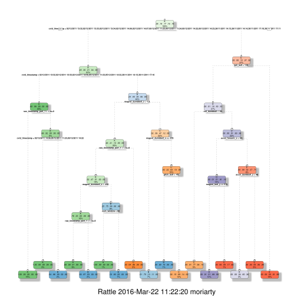

# Loading required packages


```R
library(caret)
library(data.table)
library(rpart)
library(rpart.plot)
library(RColorBrewer)
library(rattle)
library(randomForest)
```

# Reporoducability seed


```R
set.seed(17293)
```

# Data Import


```R
trainLink = "http://d396qusza40orc.cloudfront.net/predmachlearn/pml-training.csv"
testLink <- "http://d396qusza40orc.cloudfront.net/predmachlearn/pml-testing.csv"
############
training <- read.csv(url(trainLink), na.strings=c("NA","#DIV/0!",""))
testing <- read.csv(url(testLink), na.strings=c("NA","#DIV/0!",""))
```

# Train-Test Slicing (60-40)


```R
inTrain <- createDataPartition(y=training$classe, p=0.6, list=FALSE)
Training <- training[inTrain, ]; Testing <- training[-inTrain, ] #Maj T is for originial training-set derived  data
                                                                 #Min t is for originial data
```

# Data Cleaning (Low Variance Cols removal, ID removal, NA purge)

## Clearing cols with near zero variance


```R
DataNZV <- nearZeroVar(Training, saveMetrics=TRUE)
```


```R
head(DataNZV) ; tail(DataNZV)
```


<table>
<thead><tr><th></th><th scope=col>freqRatio</th><th scope=col>percentUnique</th><th scope=col>zeroVar</th><th scope=col>nzv</th></tr></thead>
<tbody>
	<tr><th scope=row>X</th><td>1</td><td>100</td><td>FALSE</td><td>FALSE</td></tr>
	<tr><th scope=row>user_name</th><td>1.097515</td><td>0.05095109</td><td>FALSE</td><td>FALSE</td></tr>
	<tr><th scope=row>raw_timestamp_part_1</th><td>1</td><td>7.099185</td><td>FALSE</td><td>FALSE</td></tr>
	<tr><th scope=row>raw_timestamp_part_2</th><td>1</td><td>90.87976</td><td>FALSE</td><td>FALSE</td></tr>
	<tr><th scope=row>cvtd_timestamp</th><td>1.017065</td><td>0.169837</td><td>FALSE</td><td>FALSE</td></tr>
	<tr><th scope=row>new_window</th><td>46.48387</td><td>0.0169837</td><td>FALSE</td><td>TRUE</td></tr>
</tbody>
</table>


<table>
<thead><tr><th></th><th scope=col>freqRatio</th><th scope=col>percentUnique</th><th scope=col>zeroVar</th><th scope=col>nzv</th></tr></thead>
<tbody>
	<tr><th scope=row>accel_forearm_y</th><td>1.03125</td><td>8.203125</td><td>FALSE</td><td>FALSE</td></tr>
	<tr><th scope=row>accel_forearm_z</th><td>1.032609</td><td>4.721467</td><td>FALSE</td><td>FALSE</td></tr>
	<tr><th scope=row>magnet_forearm_x</th><td>1.081633</td><td>11.93105</td><td>FALSE</td><td>FALSE</td></tr>
	<tr><th scope=row>magnet_forearm_y</th><td>1.163636</td><td>15.22588</td><td>FALSE</td><td>FALSE</td></tr>
	<tr><th scope=row>magnet_forearm_z</th><td>1</td><td>13.30673</td><td>FALSE</td><td>FALSE</td></tr>
	<tr><th scope=row>classe</th><td>1.469065</td><td>0.04245924</td><td>FALSE</td><td>FALSE</td></tr>
</tbody>
</table>


```R
NZVvars <- names(Training) %in% c("new_window", "kurtosis_roll_belt", "kurtosis_picth_belt",
"kurtosis_yaw_belt", "skewness_roll_belt", "skewness_roll_belt.1", "skewness_yaw_belt",
"max_yaw_belt", "min_yaw_belt", "amplitude_yaw_belt", "avg_roll_arm", "stddev_roll_arm",
"var_roll_arm", "avg_pitch_arm", "stddev_pitch_arm", "var_pitch_arm", "avg_yaw_arm",
"stddev_yaw_arm", "var_yaw_arm", "kurtosis_roll_arm", "kurtosis_picth_arm",
"kurtosis_yaw_arm", "skewness_roll_arm", "skewness_pitch_arm", "skewness_yaw_arm",
"max_roll_arm", "min_roll_arm", "min_pitch_arm", "amplitude_roll_arm", "amplitude_pitch_arm",
"kurtosis_roll_dumbbell", "kurtosis_picth_dumbbell", "kurtosis_yaw_dumbbell", "skewness_roll_dumbbell",
"skewness_pitch_dumbbell", "skewness_yaw_dumbbell", "max_yaw_dumbbell", "min_yaw_dumbbell",
"amplitude_yaw_dumbbell", "kurtosis_roll_forearm", "kurtosis_picth_forearm", "kurtosis_yaw_forearm",
"skewness_roll_forearm", "skewness_pitch_forearm", "skewness_yaw_forearm", "max_roll_forearm",
"max_yaw_forearm", "min_roll_forearm", "min_yaw_forearm", "amplitude_roll_forearm",
"amplitude_yaw_forearm", "avg_roll_forearm", "stddev_roll_forearm", "var_roll_forearm",
"avg_pitch_forearm", "stddev_pitch_forearm", "var_pitch_forearm", "avg_yaw_forearm",
"stddev_yaw_forearm", "var_yaw_forearm")
```

## First Col is ID Col, is to be taken out


```R
Training <- Training[c(-1)]
```

## A Col with +60% NA's will be taken out


```R
trainingV3 <- Training #creating another subset to iterate in loop
for(i in 1:length(Training)) {
        if( sum( is.na( Training[, i] ) ) /nrow(Training) >= .6 ) { #NAs > 60%
        for(j in 1:length(trainingV3)) {
            if( length( grep(names(Training[i]), names(trainingV3)[j]) ) ==1)  {
                trainingV3 <- trainingV3[ , -j]
            }   
        } 
    }
}
```


```R
ls ()
```


<ol class=list-inline>
	<li>'clean1'</li>
	<li>'clean2'</li>
	<li>'DataNZV'</li>
	<li>'i'</li>
	<li>'inTrain'</li>
	<li>'j'</li>
	<li>'NZVVar_names'</li>
	<li>'NZVvars'</li>
	<li>'table'</li>
	<li>'testing'</li>
	<li>'Testing'</li>
	<li>'testLink'</li>
	<li>'training'</li>
	<li>'Training'</li>
	<li>'trainingV3'</li>
	<li>'trainLink'</li>
	<li>'Vect'</li>
</ol>


```R
# Let's now update Training and remove the temporary trainingV3
Training <- trainingV3
rm(trainingV3)
dim(Training)
names(Training)
```


<ol class=list-inline>
	<li>11776</li>
	<li>59</li>
</ol>


<ol class=list-inline>
	<li>'user_name'</li>
	<li>'raw_timestamp_part_1'</li>
	<li>'raw_timestamp_part_2'</li>
	<li>'cvtd_timestamp'</li>
	<li>'new_window'</li>
	<li>'num_window'</li>
	<li>'roll_belt'</li>
	<li>'pitch_belt'</li>
	<li>'yaw_belt'</li>
	<li>'total_accel_belt'</li>
	<li>'gyros_belt_x'</li>
	<li>'gyros_belt_y'</li>
	<li>'gyros_belt_z'</li>
	<li>'accel_belt_x'</li>
	<li>'accel_belt_y'</li>
	<li>'accel_belt_z'</li>
	<li>'magnet_belt_x'</li>
	<li>'magnet_belt_y'</li>
	<li>'magnet_belt_z'</li>
	<li>'roll_arm'</li>
	<li>'pitch_arm'</li>
	<li>'yaw_arm'</li>
	<li>'total_accel_arm'</li>
	<li>'gyros_arm_x'</li>
	<li>'gyros_arm_y'</li>
	<li>'gyros_arm_z'</li>
	<li>'accel_arm_x'</li>
	<li>'accel_arm_y'</li>
	<li>'accel_arm_z'</li>
	<li>'magnet_arm_x'</li>
	<li>'magnet_arm_y'</li>
	<li>'magnet_arm_z'</li>
	<li>'roll_dumbbell'</li>
	<li>'pitch_dumbbell'</li>
	<li>'yaw_dumbbell'</li>
	<li>'total_accel_dumbbell'</li>
	<li>'gyros_dumbbell_x'</li>
	<li>'gyros_dumbbell_y'</li>
	<li>'gyros_dumbbell_z'</li>
	<li>'accel_dumbbell_x'</li>
	<li>'accel_dumbbell_y'</li>
	<li>'accel_dumbbell_z'</li>
	<li>'magnet_dumbbell_x'</li>
	<li>'magnet_dumbbell_y'</li>
	<li>'magnet_dumbbell_z'</li>
	<li>'roll_forearm'</li>
	<li>'pitch_forearm'</li>
	<li>'yaw_forearm'</li>
	<li>'total_accel_forearm'</li>
	<li>'gyros_forearm_x'</li>
	<li>'gyros_forearm_y'</li>
	<li>'gyros_forearm_z'</li>
	<li>'accel_forearm_x'</li>
	<li>'accel_forearm_y'</li>
	<li>'accel_forearm_z'</li>
	<li>'magnet_forearm_x'</li>
	<li>'magnet_forearm_y'</li>
	<li>'magnet_forearm_z'</li>
	<li>'classe'</li>
</ol>


## Let's apply these cleaning steps to the testing set


```R
clean1 <- colnames(Training)
clean2 <- colnames(Training[, -59]) #classe column
Testing <- Testing[clean1]
testing <- testing[clean2]
```

# DataTyping in order for ML Trees to function properly


```R
for (i in 1:length(testing) ) {
        for(j in 1:length(Training)) {
        if( length( grep(names(Training[i]), names(testing)[j]) ) ==1)  {
            class(testing[j]) <- class(Training[i])
        }      
    }      
}
```

# ML > Decision Trees


```R
Fit1 <- rpart(classe ~ ., data=Training, method="class")
```


```R
####### Tree Overview with plesant graphics######
```


```R
fancyRpartPlot(Fit1)
```





## Prediction with D.Trees


```R
predictions1 <- predict(Fit1, Testing, type = "class")
```


```R
#Confusion Matrix of predictions vs truth
confusionMatrix(predictions1, Testing$classe)
```


    Confusion Matrix and Statistics
    
              Reference
    Prediction    A    B    C    D    E
             A 2165   67    5    1    0
             B   50 1249   81   67    0
             C   17  190 1262  217   55
             D    0   12   20  943  184
             E    0    0    0   58 1203
    
    Overall Statistics
                                              
                   Accuracy : 0.8695          
                     95% CI : (0.8618, 0.8769)
        No Information Rate : 0.2845          
        P-Value [Acc > NIR] : < 2.2e-16       
                                              
                      Kappa : 0.8349          
     Mcnemar's Test P-Value : NA              
    
    Statistics by Class:
    
                         Class: A Class: B Class: C Class: D Class: E
    Sensitivity            0.9700   0.8228   0.9225   0.7333   0.8343
    Specificity            0.9870   0.9687   0.9261   0.9671   0.9909
    Pos Pred Value         0.9674   0.8632   0.7249   0.8136   0.9540
    Neg Pred Value         0.9881   0.9580   0.9826   0.9487   0.9637
    Prevalence             0.2845   0.1935   0.1744   0.1639   0.1838
    Detection Rate         0.2759   0.1592   0.1608   0.1202   0.1533
    Detection Prevalence   0.2852   0.1844   0.2219   0.1477   0.1607
    Balanced Accuracy      0.9785   0.8958   0.9243   0.8502   0.9126


## ML > Random Forest


```R

Fit2 <- train(classe ~. , data=Training,method = "rf")
```


```R
predictions2 = predict(Fit2, newdata = Testing)
#Fit2
```


```R
#Confusion Matrix of predictions vs truth
confusionMatrix(predictions2, Testing$classe)
```


    Confusion Matrix and Statistics
    
              Reference
    Prediction    A    B    C    D    E
             A 2232    3    0    0    0
             B    0 1515    1    0    0
             C    0    0 1363    0    0
             D    0    0    4 1286    0
             E    0    0    0    0 1442
    
    Overall Statistics
                                             
                   Accuracy : 0.999          
                     95% CI : (0.998, 0.9996)
        No Information Rate : 0.2845         
        P-Value [Acc > NIR] : < 2.2e-16      
                                             
                      Kappa : 0.9987         
     Mcnemar's Test P-Value : NA             
    
    Statistics by Class:
    
                         Class: A Class: B Class: C Class: D Class: E
    Sensitivity            1.0000   0.9980   0.9963   1.0000   1.0000
    Specificity            0.9995   0.9998   1.0000   0.9994   1.0000
    Pos Pred Value         0.9987   0.9993   1.0000   0.9969   1.0000
    Neg Pred Value         1.0000   0.9995   0.9992   1.0000   1.0000
    Prevalence             0.2845   0.1935   0.1744   0.1639   0.1838
    Detection Rate         0.2845   0.1931   0.1737   0.1639   0.1838
    Detection Prevalence   0.2849   0.1932   0.1737   0.1644   0.1838
    Balanced Accuracy      0.9997   0.9989   0.9982   0.9997   1.0000


# Random Forests FTW !!!!


```R
########################GENERETING FILES FOR SUBMISSION########################

```


```R
#levels(training$SectionName) <- levels(train$SectionName)
publication <- predict(Fit2, testing)
```


```R
export_results = function(x){
  for(i in 1:length(x)){
    filename = paste0("results/problem_id_",i,".txt")
    write.table(x[i],file=filename,quote=FALSE,row.names=FALSE,col.names=FALSE)
  }
}
export_results(publication)
```


```R

```
